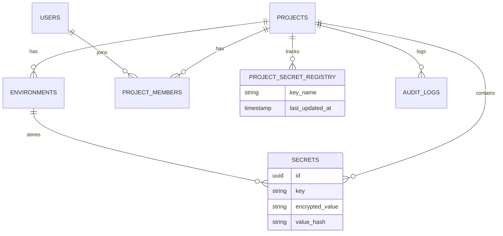

# Secrets Manager Schema Documentation

## Overview
This document explains the PostgreSQL schema design for the Secrets Manager platform. The schema focuses on data integrity, auditability, and efficient synchronization status tracking.

## Core Design Decisions

### 1. Environments & Production Security
- **Environments**: Flexible and user-defined (e.g., dev-john, staging-v1).
- **Production Isolation**: A boolean flag `is_production` identifies the production environment. A strict partial unique index `idx_one_prod_env_per_project` enforces that a project can have **only one** production environment.
- **RBAC**: Application-level logic, supported by the `project_members.role` enum, restricts visibility. "Production" rows are just rows; access control allows only ADMINs to SELECT from `secrets` where `environment_id` points to a production environment.

### 2. Secrets Management
- **Encryption**: Values are encrypted **at rest** (application-side encryption assumed). The database stores `encrypted_value`.
- **Value Hashing**: A `value_hash` column stores a deterministic hash (e.g., SHA-256) of the *decrypted* value. This allows:
  - Checking for duplicates without decrypting.
  - Efficiently comparing secrets between environments (Diffing).
- **Soft Deletes**: `deleted_at` ensures passed mistakes can be recovered or audited. The unique constraint for keys excludes soft-deleted records.

### 3. Syncing Logic ("Out of Sync" Detection)
The requirement is: *"If a secret changes in one environment, mark other environments as 'out of sync'"*.

To solve this efficiently without complex O(N*M) logic on every update, we introduced a **Registry Pattern**:
- **Table**: `project_secret_registry`
- **Concept**: This table acts as the "master list" of known keys for a project.
- **Mechanism**:
  1. Whenever a secret is created/updated in *any* environment, the application updates the `project_secret_registry.last_updated_at` for that key.
  2. To check if Environment A is in sync:
     Compare `secrets.updated_at` (in Env A) vs `project_secret_registry.last_updated_at`.
  3. If `secrets.updated_at < registry.last_updated_at`, it means a newer version of this secret exists somewhere else (or the key definition changed).

### 4. Audit Logs
- **Immutable Append-Only**: The `audit_logs` table records every mutation.
- ** traceability**: Every row links to `user_id` (who), `action` (what), `timestamp` (when), and `reason` (why).
- **Values**: We strictly store **hashes** of old and new values, never the raw secrets, ensuring the audit log doesn't become a leak vector.

## Schema Diagram (Conceptual)

